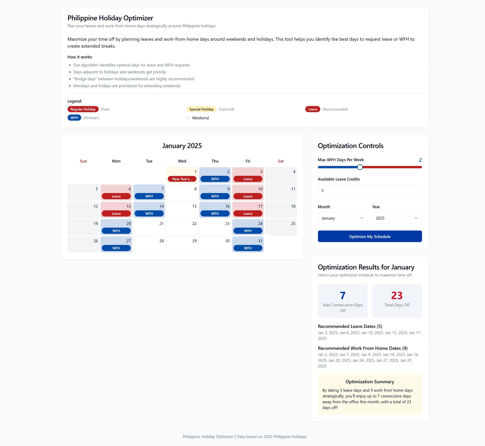

# Philippine Holiday Optimizer 🇵🇭

A web application designed to help users in the Philippines strategically plan their leave days and work-from-home (WFH) schedule around public holidays to maximize consecutive time off. It visualizes holidays for a selected month and year (currently focused on 2025 data) and provides an optimized schedule based on user preferences.



## Features

*   **Monthly Calendar View:** Displays a calendar for the selected month and year.
*   **Holiday Highlighting:** Clearly marks Regular Holidays (paid) and Special Non-working Holidays.
*   **Optimized Schedule Visualization:** Shows recommended Leave days and Work-From-Home (WFH) days directly on the calendar.
*   **User Configuration:**
    *   Set the maximum number of WFH days allowed per week.
    *   Input the total number of available leave credits.
    *   Select the target month and year (currently defaults and data focus on 2025).
*   **Optimization Results:**
    *   Calculates the maximum number of consecutive days off achievable with the plan.
    *   Shows the total number of days off (weekends + holidays + leave + WFH).
    *   Lists the specific dates recommended for Leave and WFH.
*   **Informative Legend:** Explains the color-coding and badges used in the calendar.
*   **Responsive Design:** Adapts to different screen sizes.

## How it Works

The optimizer uses a scoring system based on the 2025 Philippine holiday list:

1.  **Holiday Data:** Uses a predefined list of 2025 Regular and Special Non-working holidays.
2.  **Leave Day Scoring:** Potential workdays are scored based on their potential to create long weekends or bridge gaps:
    *   Days adjacent (immediately before/after) to weekends or holidays get higher scores.
    *   "Bridge days" (workdays falling between two off-days like a weekend and a holiday) receive the highest scores.
    *   Mondays and Fridays generally get a boost for extending weekends.
3.  **Leave Allocation:** The highest-scoring workdays are recommended as leave days, up to the user's specified limit.
4.  **WFH Allocation:** Remaining workdays are considered for WFH. The optimizer prioritizes days that are strategically beneficial (e.g., adjacent to off days) and distributes them across the weeks, respecting the user's maximum WFH days per week limit.
5.  **Metrics Calculation:** Calculates the longest consecutive block of off-days (weekends, holidays, leave, WFH) and the total number of off-days in the month based on the generated plan.

*Note: The current holiday data and optimization logic are based on the year 2025.*

## Technology Stack

*   **Frontend Framework:** React
*   **Build Tool:** Vite
*   **Language:** TypeScript
*   **Styling:** Tailwind CSS
*   **UI Components:** shadcn/ui (built on Radix UI)
*   **Icons:** Lucide React
*   **Date Manipulation:** `date-fns`
*   **Routing:** React Router DOM
*   **State Management:** React Hooks (`useState`, `useEffect`)

## Getting Started

To run this project locally:

1.  **Clone the repository:**
    ```bash
    git clone <your-repository-url>
    cd cuti-ph-optimizer
    ```
2.  **Install dependencies:**
    ```bash
    npm install
    # or
    # yarn install
    # or
    # pnpm install
    ```
3.  **Start the development server:**
    ```bash
    npm run dev
    # or
    # yarn dev
    # or
    # pnpm dev
    ```
4.  Open your browser and navigate to `http://localhost:8080` (or the port specified in your console).

## Available Scripts

In the project directory, you can run:

*   `npm run dev`: Runs the app in development mode with hot reloading.
*   `npm run build`: Builds the app for production to the `dist` folder.
*   `npm run lint`: Lints the codebase using ESLint.
*   `npm run preview`: Serves the production build locally for testing.

## Project Structure

cuti-ph-optimizer/
├── public/             # Static assets (favicon, images, robots.txt)
├── src/
│   ├── components/     # Reusable UI components (ControlPanel, Calendar, Results, UI primitives)
│   ├── hooks/          # Custom React hooks (use-toast, use-mobile)
│   ├── lib/            # Utility functions (cn)
│   ├── pages/          # Page components (Index, NotFound)
│   ├── utils/          # Core logic (holidayUtils)
│   ├── App.tsx         # Main application component with routing
│   ├── main.tsx        # Application entry point
│   └── index.css       # Global styles and Tailwind directives
├── .eslintrc.js        # ESLint configuration
├── tailwind.config.ts  # Tailwind CSS configuration
├── vite.config.ts      # Vite configuration
├── package.json        # Project metadata and dependencies
└── README.md           # This file

## Contributing

Contributions are welcome! Please feel free to submit a Pull Request or open an Issue.

## License

*(Specify your license here, e.g., MIT License)*